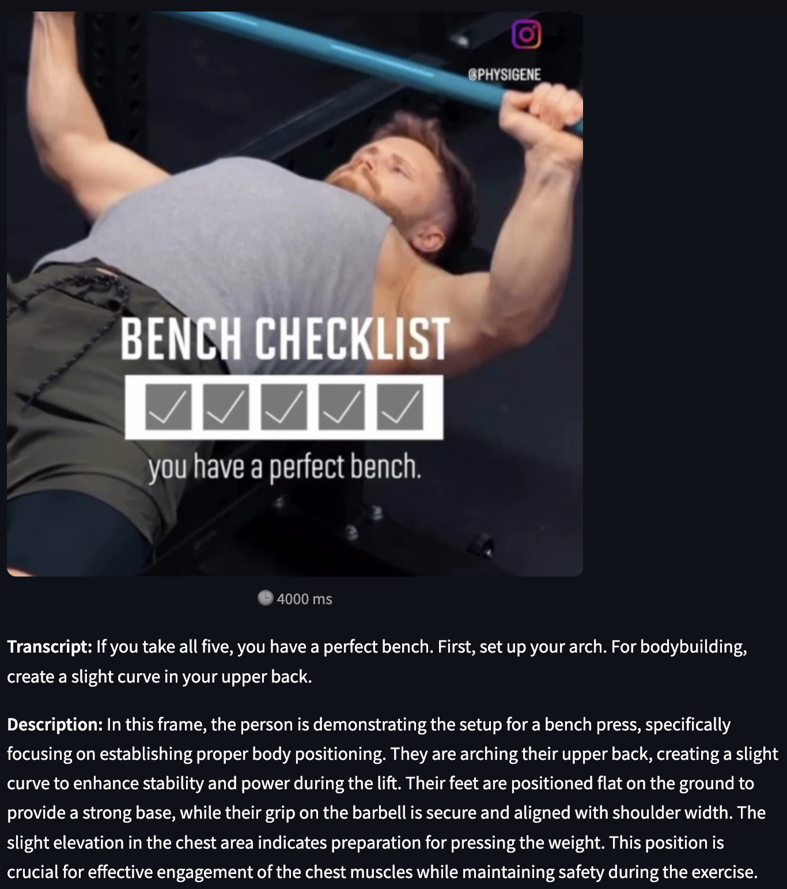
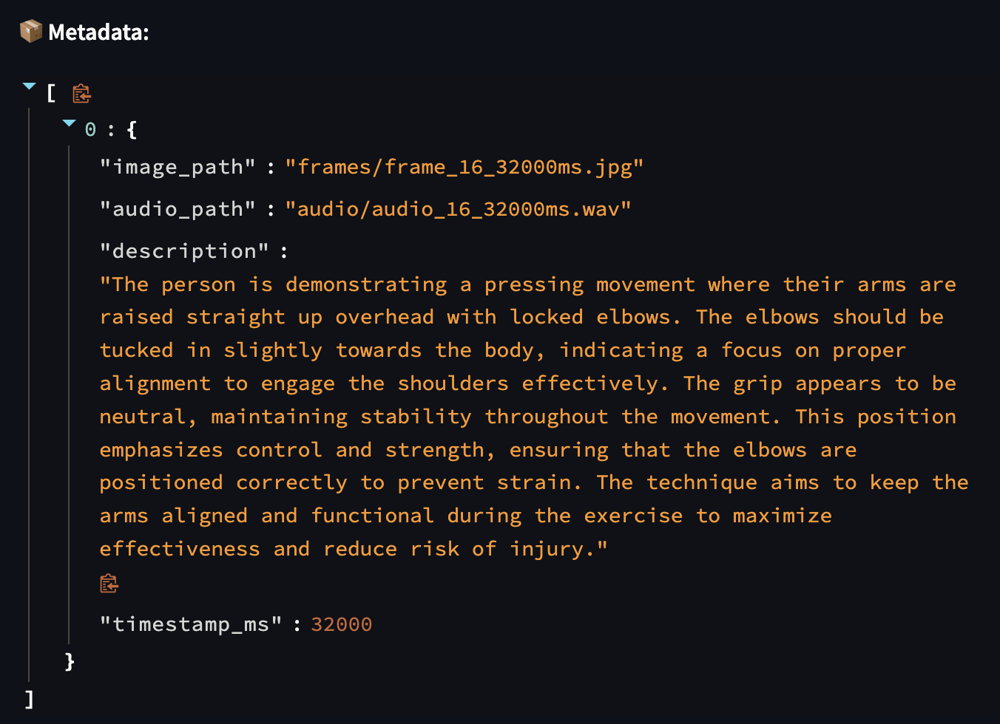
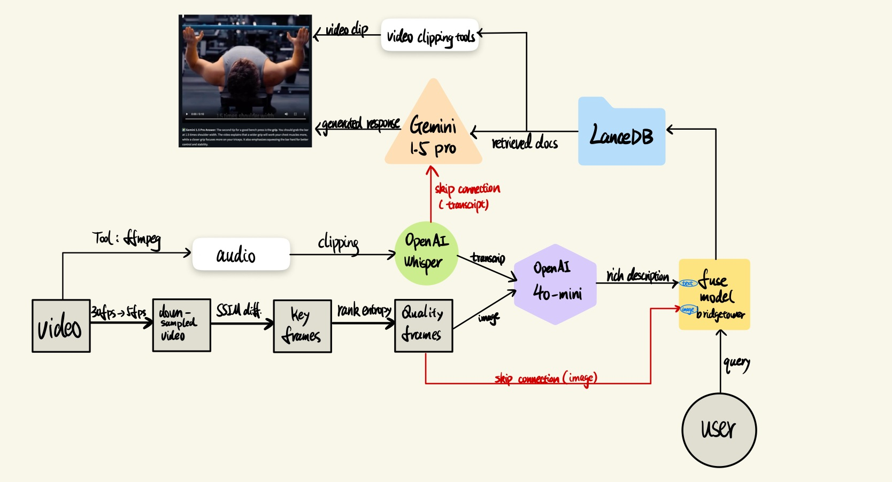

# 🎬 Multimodal RAG: Interactive Video Learning Platform

[](https://streamlit.io/)
[](https://www.python.org/)
[](https://opensource.org/licenses/MIT)


---

## 🧩 Problem Statement

Learning from tutorial videos requires understanding complex interactions between **visual cues**, **spoken language**, and **user intent**. Traditional approaches to multimodal retrieval and question answering often **ground all modalities into text**, stripping away rich visual context and temporal dynamics embedded in video frames. This leads to a **loss of spatial and motion information**, especially when users ask about specific actions or techniques demonstrated visually.

Even when systems employ multimodal models like CLIP, they often treat **images and text independently**, failing to **fuse their semantics** in a meaningful way. As a result, these models cannot reason over **aligned visual-verbal information**—for instance, connecting a movement in the video with a specific spoken instruction.

To address these limitations, I propose an **enhanced multimodal Retrieval-Augmented Generation (RAG) system** by integrating **cross-modality-attention mechanisms and skip connections**, ensuring that both visual and textual modalities interact richly and are preserved throughout the pipeline.

- Accepts **text queries, image snapshots, or both**
- Uses **joint image-text embeddings** (BridgeTower) to capture **cross-modal interactions**
- Retrieves the most relevant **video frames, transcripts, and descriptions**
- Generates intelligent, context-aware answers grounded in the retrieved content


---
### 🧾 2. Data Sources
---
- Video Uploads: Users upload fitness tutorial videos (e.g., bench press instruction). **credit by @PHYSIGENE**
  * 🎬 [Click to view sample video](data/raw_video/sample.mp4)

- Generated Descriptions & Transcripts: Using frame extraction, OpenAI Whisper for transcription, and GPT-4o for visual description of each frame.


- Metadata Storage: All processed information (image paths, timestamps, descriptions, transcripts, etc.) is stored in LanceDB.


## 🔍 Review of Related Work

### 📚 Existing RAG Pipelines
- Popular RAG frameworks like **[LangChain](https://www.langchain.com/)** and **[Haystack](https://haystack.deepset.ai/)** focus primarily on **text-only retrieval and generation**. These pipelines are highly effective for unstructured documents but lack support for **visual or multimodal content**.

### 🧠 Vision-Language Embeddings
- Models such as **CLIP** and **BridgeTower** allow for semantic similarity across modalities. However, they are often used without **context injection**, limiting their ability to generate meaningful, grounded responses that combine retrieved knowledge.

### 🎥 Gaps in Multimodal Retrieval Applications
* Many existing multimodal retrieval systems fail to align:
  - The **retrieved video clip**
  - The **corresponding transcript**
  - And the **user's query intent**
* This creates a disconnect between **what’s visually shown**, **what’s verbally said**, and **what’s asked**.

### 🔗 Resources and Inspirations

- [An Easy Introduction to Multimodal RAG](https://developer.nvidia.com/blog/an-easy-introduction-to-multimodal-retrieval-augmented-generation/)
- [Build an Enterprise-Scale Multimodal Retrieval Pipeline](https://developer.nvidia.com/blog/build-an-enterprise-scale-multimodal-document-retrieval-pipeline-with-nvidia-nim-agent-blueprint/)
- [Evaluating Retriever Quality for Enterprise-Grade RAG](https://developer.nvidia.com/blog/evaluating-retriever-for-enterprise-grade-rag/)
- [Multimodal RAG with Langchain](https://www.deeplearning.ai/short-courses/multimodal-rag-chat-with-videos/)
- [Multi-Modal RAG: A Practical Guide](https://gautam75.medium.com/multi-modal-rag-a-practical-guide-99b0178c4fbb)


---
## 📷 Supported Queries Samples

| Type         | Supported Input              | Behavior                      |
|--------------|------------------------------|-------------------------------|
| Text-only    | `"What is happening?"`       | Embeds text only              |
| Image-only   | Upload screenshot of a given scene            | Uses default prompt for image |
| Text + Image | Upload scene image + ask question  | Uses both for joint embedding |

---
## 📊 Model Evaluation

I use **human evaluation** as our primary assessment method due to the inherently multimodal and subjective nature of the task. Since the system retrieves and generates answers based on both visual and textual content from videos, standard automated metrics like BLEU or cosine similarity often fail to capture the true relevance and helpfulness of responses. Human evaluators were able to judge the **accuracy**, **groundedness**, and **usefulness** of the system’s output in context, especially when reasoning over video frames and audio. This approach provided richer qualitative insights into the system's strengths and limitations, making it a more suitable choice for evaluating real-world user experience.


---
## 🌐 General Modeling Approach (High Level)


1. User Input: Accept either:
    * text-only question
    * image-only query
    * image + question combo
2. Embedding Stage:
    * BridgeTower encodes user query and image into a multimodal vector
3. Retrieval Stage:
    * LanceDB returns top-k similar video frames + descriptions
4. Context Formation:
    * For Naive Approach: inject image and description into GPT-4o prompt
    * For Improved Deep Learning Approach: inject all images + descriptions + full transcript into Gemini 1.5 Pro
5. Generation Stage:
    * For Naive Approach: Open4o (LLM) produces final answer based on only the text context
    * For Improved Deep Learning Approach: Gemini1.5-pro (LVLM) produces final answer based on context of all modalities (visual, sound, text)

---
## ⚙️ Data Processing Pipeline
* Video Upload
* Downsampling & Scene Detection (OpenCV + MoviePy)
* Frame Filtering (entropy, blur detection)
* Audio Extraction (ffmpeg)
* Whisper Transcription
* Vision Description (GPT-4o frame-level prompting)
* Metadata Compilation + LanceDB Seeding

---
## 🔬 Results and Conclusion
* The system enables precise QA grounded in visual + linguistic information
* Improved DL Approach outperforms Naive Approach on understanding the video's content and on preciseness of response generations.
* The system can handles ambiguous or underspecified questions
* Video-base multimodel-rag pipeline achieves fast response times and high-quality answers
---

## ⚖️ Video Demo of Comparing Performance btw. Naive Approach and Improved DL Approach
[check out this video](https://youtu.be/ahkUO0b5QmE)

---

## ✊ Ethics Statement
* All uploaded data is processed locally and only stored temporarily for the session
* We ensure no identifiable personal data is processed
* Model outputs are filtered to remain instructional, avoiding biased or harmful content
* This project is for research and educational demonstration only

---

## 🚀 Quickstart

### 1. Clone the repo

```bash
git clone https://github.com/tonywang638156/Multimodel-RAG.git
cd Multimodel-RAG
```

### 2. Set up the environment
```bash
git clone https://github.com/tonywang638156/Multimodel-RAG.git
cd Multimodel-RAG
```

### 3. Get an OpenAI API key
Create a .env file in the project root, replace OPENAI_API_KEY and GOOGLE_API_KEY with your own api key
```bash
OPENAI_API_KEY=sk-...
GOOGLE_API_KEY=AI-...
```

### 4. Run the app
```bash
streamlit run app.py
```
---
## Deployment: Host on AWS: [click here](http://18.222.115.92:8501/)
